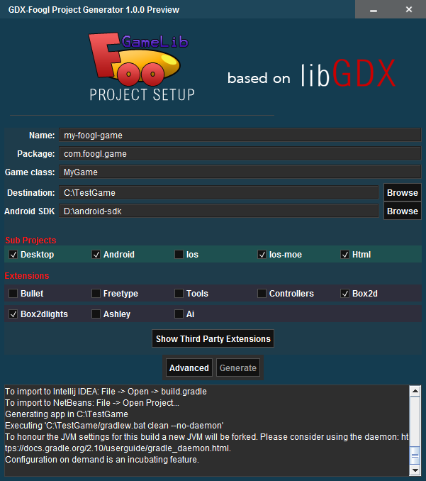
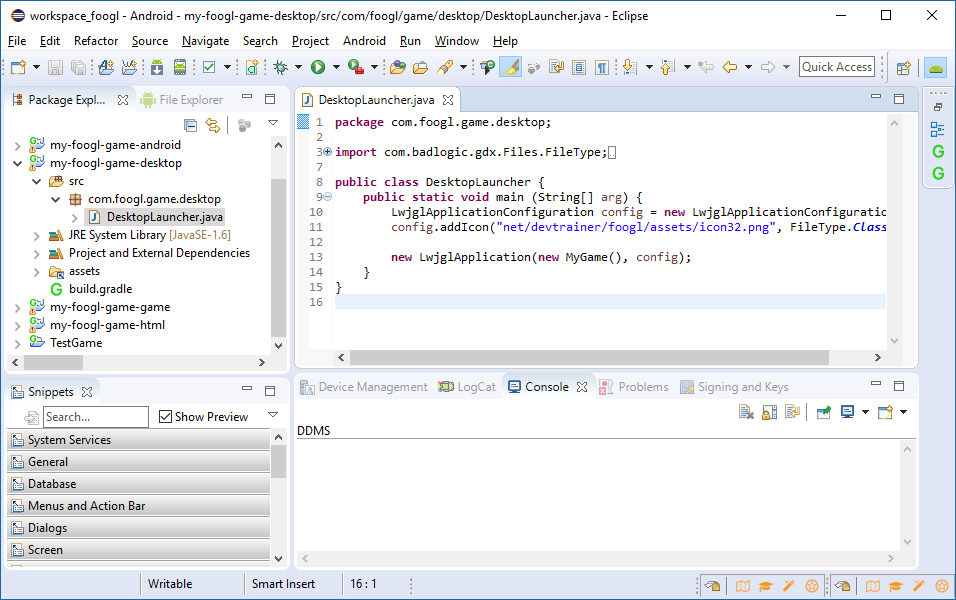
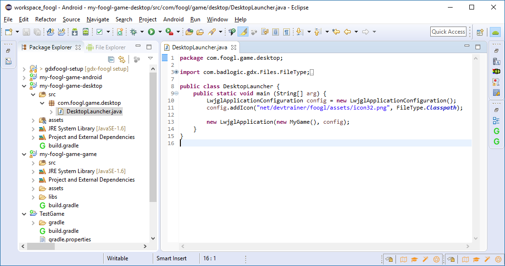
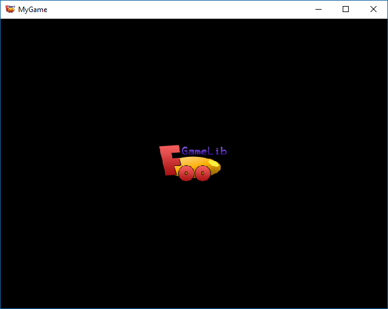

GDX-Foogl project setup
===================

GDX-Foogl is based on [libGDX setup)(https://github.com/libgdx/libgdx/tree/master/extensions/gdx-setup). This setup powered by gradle, allowing any combination of sub projects and official extensions to get you up and running in a few clicks.  Although this tool will handle setup for you, LEARN GRADLE!

# Using
1. Download [gdxfoogl-setup.jar](gdxfoogl-setup.jar)
2. Double Click gdxfoogl-setup.jar

The builder will generate the settings.gradle, build.gradle file, as well as alter all the platform specific files that reference dependencies/assets. The generated project can be opened with the Java IDE such as Eclipse, Netbean or Android Studio.

# Eclipse
- We recommend to install the lastest version of Eclipse for Android Developers. You can install via [Eclipse Neon](http://www.eclipse.org/downloads/)
1. Open Menu: File/Import/Gradle

  Import the generated project folder, which is created by GDX-Foogl project setup.
  
2. Run on Desktop
   Open poject: "your-project-game" and run class com.foogl.game.desktop.DesktopLauncher as Java Application  
   

3. Demo scene will open!!

 
